# Knuckle_Down
Knuckle Down is a list-based ToDoApp with a Pomodoro-timer. [Find out more](#App_description) or [see screenshots](#Screenshots).

## Built with
- MVVM pattern
- Coroutines
- Flow
- LiveData (Transformations)
- ViewModel
- ListAdapter
- Room
- RecyclerView
- Navigation Component Library 
- Material Design

## App description  
Now Knuckle Down contains five lists for tasks in the side menu:
- Inbox for for quickly adding a task or a task without time;
- Today displays the tasks for the current day;
- Tomorrow contains the tasks for the next day;
- Calendar allows you to display tasks for any specified day;
- Actions contain delegated tasks or tasks for which additional information is expected.
  
Using the Pomodoro timer implies that the user shouldn't use the phone when the timer is running. So the timer resets when configuration or state changes. 
 
Completed and overdue tasks are marked green and red, respectively.
 
The app supports a dark theme.
 
**The app has been tested by Talkback and Accessibility Scanner, so it is available for visually impaired or blind users.**

## Screenshots  
The app has been tested on various devices:
- Physical devices: 
  - Yandex Phone (API 28, 5.65", 1080x2160)
  - Huawei Y5 2019 (API 28, 5.71", 720x1520)
- Virtual devices:
  - Pixel 2 (API 24, 5.0", 1080x1920)
  - Pixel XL (API 30, 5.5", 1440x2560)
  - Pixel 5 (API 30, 6.0", 1080x2320)
  - Pixel 6 Pro (API 32, 6.7", 1440x3120)
  
Below are screenshots from these devices. You can hover over the image to see which device it is. Dark theme enabled on some devices.
 

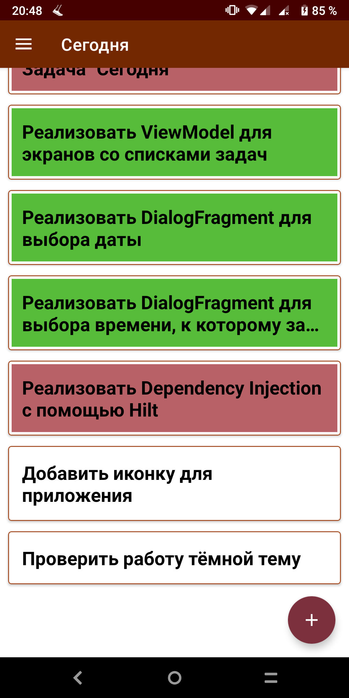
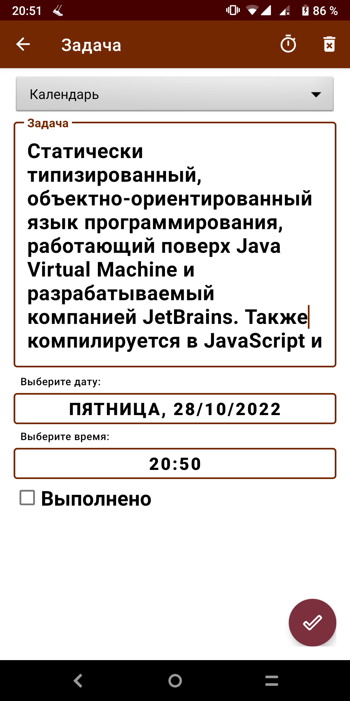

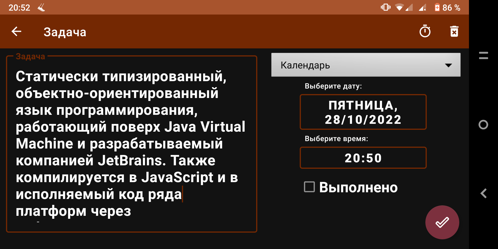

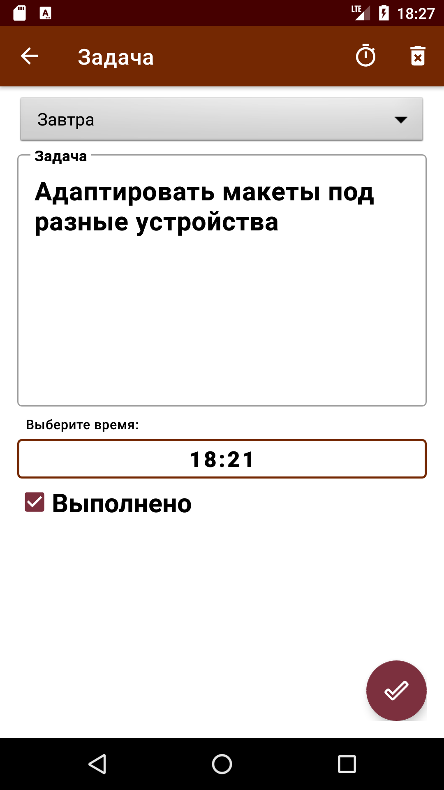
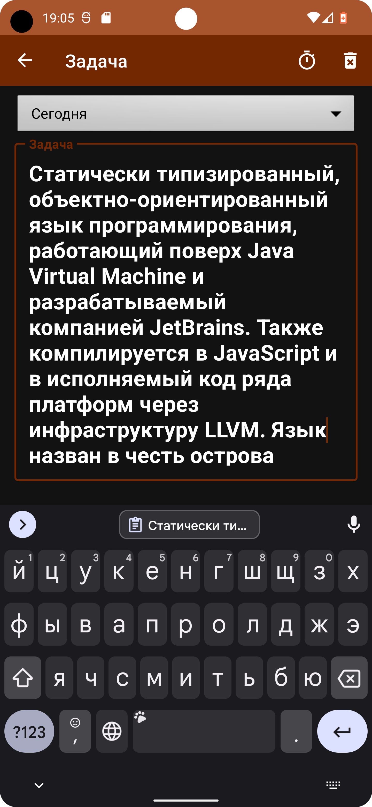

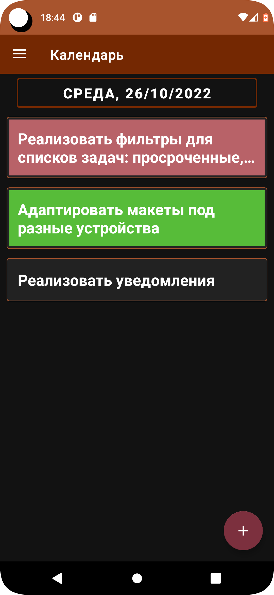
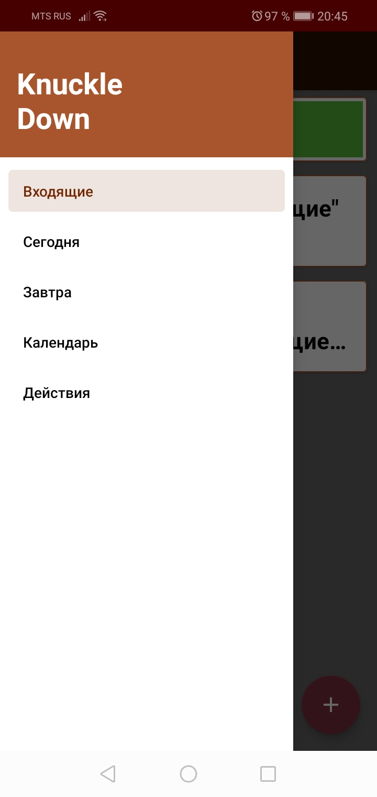

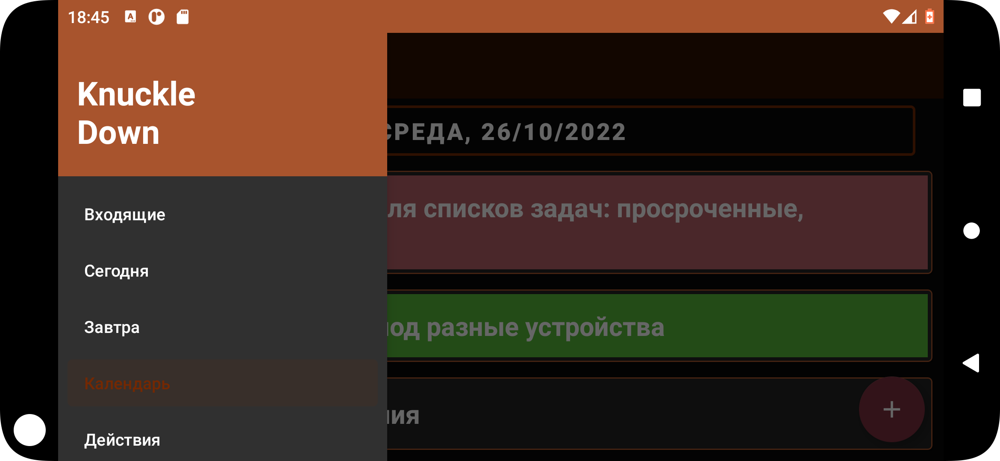

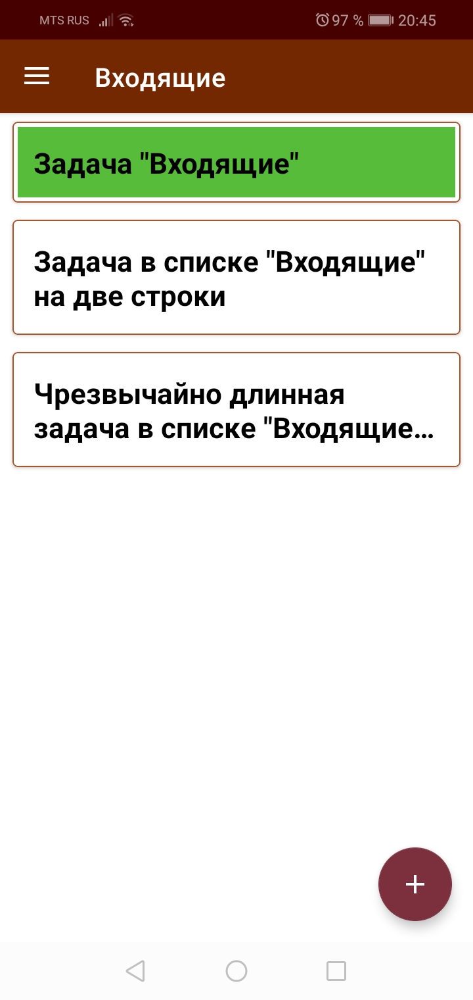
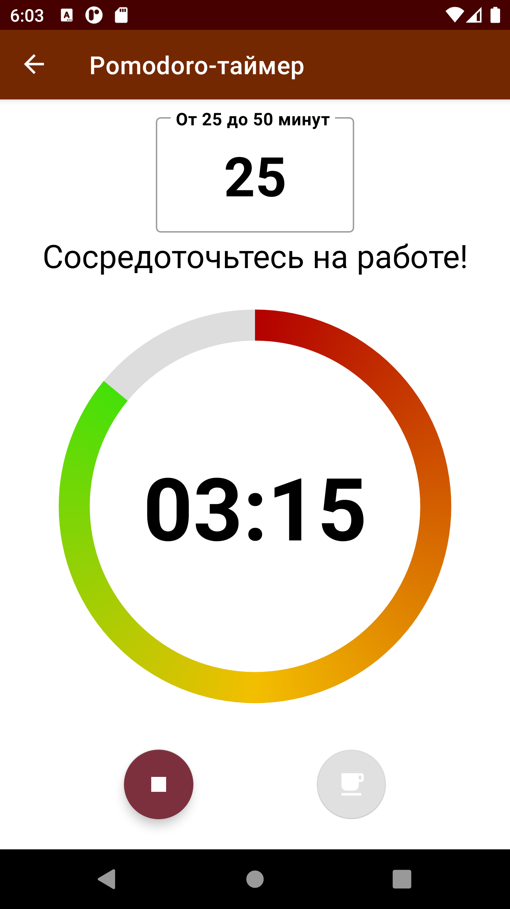

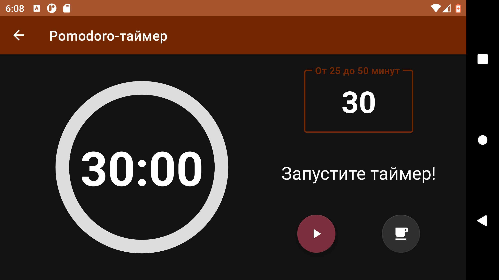
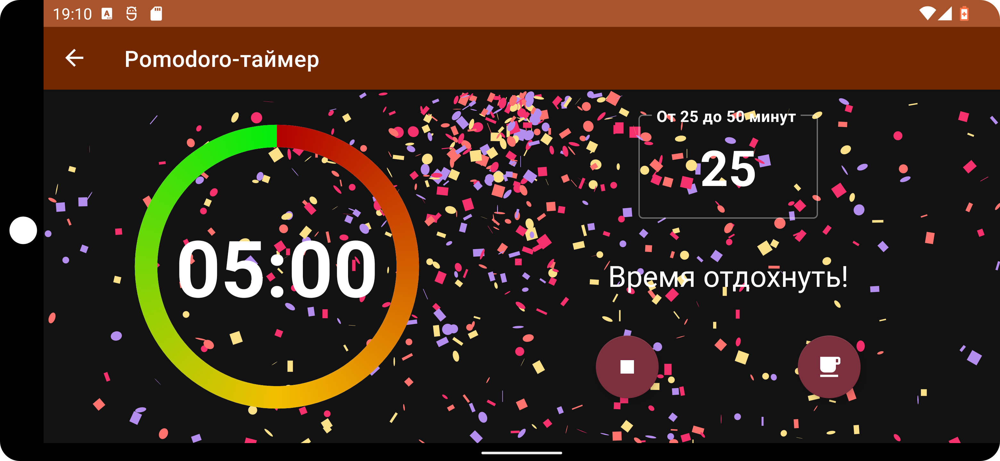
